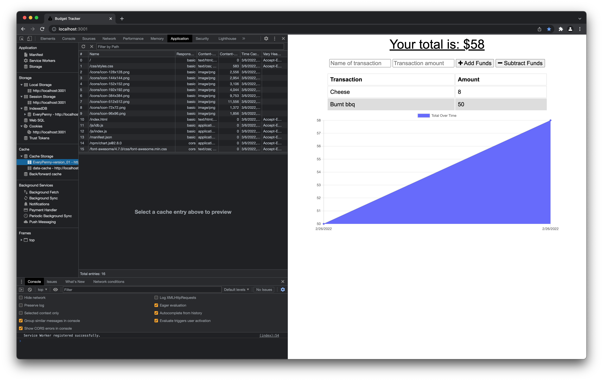
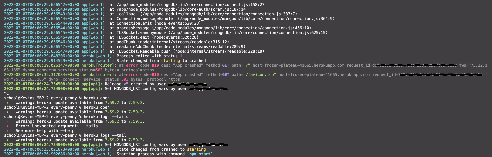

# Every Penny 

Every Penny is an app that provides a fast and easy way to track your money. We know what's important, and that includes the ability to access the information you need at any time.

This offline functionality is achieved through service workers, as seen in the screenshots below.

## Features
- Added `idb.js` file containing IndexedDB
- Added `manifest.json` for Web Manifest

## Future Features
- Under construction:
  - You will be able to add expenses and deposits to your budget along with the ability to update the total once you're brought back online
  - I attempted to deploy the app using Heroku but I ran into several issues such as this error:

  - However, I already:
    - Created a MongoDB Atlast Account
    - Created a Production Database in Atlast
    - Set Up the Environment Variable in Heroku
    - Connect Production Database to App

